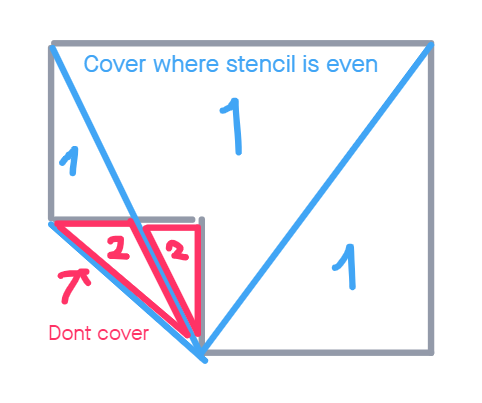

# Higharc Computational Geometry Engineer Challenge

https://dusanbosnjak.com/test/higharc/comp/

```
npm install
npm run start
```
```
yarn
yarn start
```

## Decription

The graph algorithm uses half edges to create polygons out of vertices and edges:
1. The input edges are traversed and half edges are created
2. Half edges are put in a pool which is processed
3. Take one edge from the pool and query it's end vertex for any other edges that may originate from that vertex
4. sort these edges by angle going in CW or CCW direction
5. take the closest edge (smallest angle) to the previous edge, and continue walk
6. walk until an edge is found whos end vertex is the start vertex of the first edge in the traversal, this is a loop
7. create a face
8. walk the loop backwards. push each half edge into the new face, remove from pool
9. repeat 3 until pool is empty

## Rendering

Each polygon is rendered with two draw calls. The polygons are triangulated via a simple triangle fan originating from one arbitrary vertex inside a polygon. This geometry is rendered twice, once with a stencil write, and second time with the color fill. I thought the assignment didn't necessarily call for triangulating the polygons in any special way, and that three.js's job here is minimal, so this felt like the simplest solution.

## Testing / debugging

There is no testing framework (eg. Jest) and no labels for made polygons. There is an embedded "test" that compares a hardcoded value with the result of the algorithm (the polygon count).
There is also UI output that changes with mouse interaction. Hovering a polygon should show it's index, the polygon's neigbors, and the result of a BFS traversal through the neighbors. 

The reasoning here was that even finding a center point and drawing some text (eg. easy with the canvas api?) would involve some transformation/math where three's vector classes could come in handy and it felt outside the scope. Hence inspecting indices via hover interaction. It also allows the neigbor searches to be "tested" from each face manually. 

## Notes
- took more than the alloted time, but the basic requerements were kept under
- figured out the solution, then abandoned it, then came back to it :| I couldn't find a way to do this by just traversing the edges ignoring the angles. 
- a method was used to find the normal from the linked article. I tried to cross edges  that weren't colinear and count the signs but this didn't work. 
- the solution for alg3 involves a check for when the ray is passing through the vertex. I don't have a test for this, but it's possible to log a point at 0,0 on some of the shapes and create these conditions.

## Diagrams

### Polygon search

 

### Polygon fill


